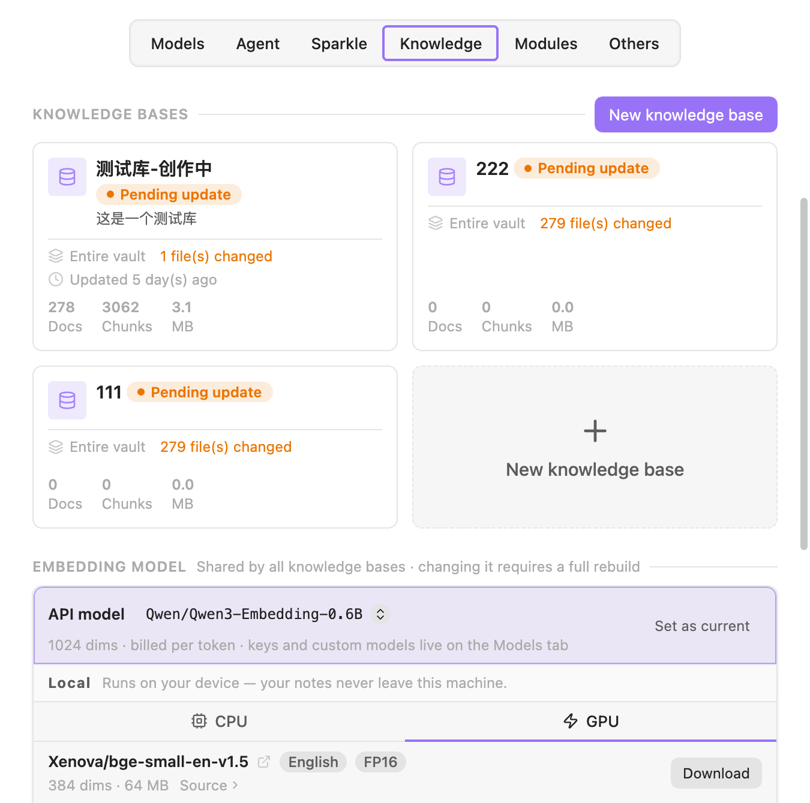

# Knowledge base and retrieval

Only once your vault is indexed has YOLO really "read" your notes — not because you point at them with `@` every time, but because it can find the relevant material by meaning on its own.

Where to configure: **Settings → YOLO → Knowledge**.

## What happens without an index

It still works. The AI has a **Vault Search** tool, and without an index it **quietly falls back to pure keyword search** — it will find notes that match literally, but not the ones that say the same thing in different words.

You'll see a banner saying: **Knowledge base indexing is off** · "The Agent's Search tool will only use keyword search. Choose an embedding model below, then turn indexing on."

Once there's an index, that same tool becomes a **hybrid of vector and keyword search**. You don't have to switch any "RAG mode" — the AI just uses it.

## Getting the index built

You need an **embedding model** first, or the enable button stops you. Embedding models come from two places:

### Use an API embedding model

First go to the [Models](./models.md) tab and add an embedding model to one of your providers (OpenAI's `text-embedding-3-small`, for instance), then come back to the Knowledge tab and select it in the **API model** row.

> **Selecting it isn't enough — you also have to click Set as current.** That's not a redundant design: switching embedding models invalidates every existing vector, which means rebuilding the index for the whole vault. The extra step is there so a mis-click in a dropdown can't trigger a full rebuild.

### Use a local embedding model (no API key needed)

The embedding model area has a **Local (on-device)** shelf. These models run on your own computer, so **your notes never leave the machine**.

**Desktop only** — on mobile it shows as unavailable.

The models on offer:

| Model | Language | Dimension | Size | Notes |
|------|------|------|------|------|
| BGE Small (English) | English | 384 | ~33 MB | Lightweight |
| BGE Small (Chinese) | Chinese | 512 | ~23 MB | Lightweight; the first pick for a Chinese vault |
| Multilingual E5 Small | Multilingual | 384 | ~129 MB | |
| Nomic Embed Text v1.5 | English | 768 | ~132 MB | Long context (8192 tokens) |
| BGE-M3 | Multilingual | 1024 | ~560 MB (~1.05 GB for the GPU build) | High quality, heavy |
| Qwen3 Embedding (0.6B) | Multilingual | 1024 | ~1.13 GB | The heaviest |

Click **Download** and you get a progress bar plus an integrity check on the file when it finishes. You can switch between **CPU / GPU (WebGPU)**; the option is disabled on devices without GPU support.

There's a counterintuitive point about quantization: **q8 (int8-quantized) models can only run on CPU, and putting them on WebGPU actually makes them slower**. Some models offer an fp16 variant made specifically for the GPU. Qwen3 is decoder-only, and int8 quantization makes its vectors drift, so it's offered only as fp16 — which is also why it's the largest download.

Local embedding depends on the **Embedding engine** runtime component. If it isn't installed or has been disabled, you'll be prompted to enable it first; see [Tools and permissions](./tools-and-permissions.md#runtime-components).

Model files live in the plugin's own folder, so they're **not in your vault and not part of sync**. Deleting one takes two confirmation clicks on the model entry.

### Turning it on

With an embedding model in place, click **Enable and index** on the status row. Progress shows up in the status row and the status bar at the bottom: which base is being processed, the percentage, and the current file name.

> Screenshots in this documentation show the English interface.

## Multiple knowledge bases

You can split your vault into several independent knowledge bases, each covering a different scope — "Work notes" and "Reading notes" kept apart, say. When searching, the AI **works out which one to query from the name and description**.

Click **New knowledge base**; there are only three things to configure per base:

- **Name** — required, and it has to be unique
- **Description** — optional, but write one. **This text is handed to the model to help it decide which base to search**
- **Scope**, included and excluded — a visual folder picker: hover over a folder to mark it included or excluded. Rules pass down to subfolders, and a subfolder can override them. No rules at all means the whole vault gets indexed

The card shows the status (Ready / Indexing / Pending update / Queued / Needs attention) along with the number of docs, the number of chunks, and how much space it takes.

> **Every knowledge base shares the same embedding model**, and the same chunking settings. The only thing that's per-base is the index scope.

## Keeping the index up to date

### Auto update

On by default. After you edit a note, it syncs the change into the index once you've been idle for about five minutes. Failures are retried with a 5 / 15 / 30-minute backoff.

### Manual update

- **Update now on the status row** — immediately syncs every file that has changed
- **Rebuild this base on a single knowledge base** — in the card's "…" menu
- **Command palette → `Update index for modified files`** — all bases, incremental
- **Command palette → `Rebuild entire vault index`** — all bases, full rebuild

### When you have to rebuild by hand

Some changes **don't** take effect on their own; they need a full rebuild run manually:

- Changing the embedding model
- Changing the chunk size

Either change only affects content indexed from that point on; existing vectors are not recomputed. Rebuild after you change one, or old and new vectors get mixed together and retrieval quality goes mysteriously bad.

## Advanced settings

The bottom of the Knowledge tab has a collapsed group of advanced settings. They're all **global**, not per knowledge base:

| Setting | Default | What it does |
|------|------|------|
| **Index PDF files** | on | If you don't need PDF search in a large vault, turning this off speeds things up noticeably |
| **Chunk size** | 1000 | Changing it only really takes effect after a manual rebuild |
| **Minimum similarity** | 0.0 | Raise it to filter out barely-related results |
| **Limit** | 10 | How many results each search returns |
| **Embedding concurrency** | 10 | Range 1–24. **If you're getting 429 rate-limit errors, turn this down** |

> On a free tier or a per-minute quota (Azure S0, for instance), concurrency is the single most common source of errors. Firing ten requests at once while indexing a lot of notes trips the rate limit easily; 2–3 usually settles it down.

The status row's "…" menu also has **Manage index data**, where you can see the total number of vector entries per embedding model and remove parts of the index individually.

## How retrieval actually happens

You don't have to do anything. When the AI decides it needs to look at your notes it calls the **Vault Search** tool itself. It can name which knowledge base to search (working from the name and description you wrote); if it doesn't name one, results from all bases are merged.

If you want to force it to look at one specific note, an `@` mention is more direct — a mention is certain, retrieval is probabilistic.

---

## Related

- How to add an embedding model: [Models and providers](./models.md)
- Permission settings for the search tool: [Tools and permissions](./tools-and-permissions.md)
- Continuing from similar notes while you write: [Sparkle](./sparkle.md)
