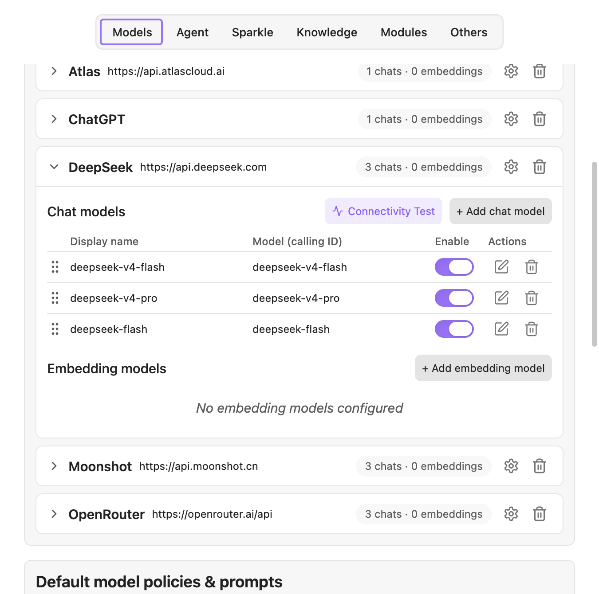

# 快速开始

这一篇带你从零装好 YOLO，配好一个能用的模型，完成第一次对话。全程大约五分钟。

## 安装

### 从社区插件市场（推荐）

1. 打开 Obsidian 设置 → **社区插件** → **浏览**
2. 搜索 **YOLO**
3. 点击安装，然后启用

### 手动安装

1. 从 [Releases](https://github.com/Lapis0x0/obsidian-yolo/releases) 下载最新版的 `main.js`、`manifest.json`、`styles.css`
2. 在库里创建目录 `<你的库>/.obsidian/plugins/obsidian-yolo/`
3. 把三个文件放进去，回到 Obsidian 设置里启用插件

> **YOLO 不能和 [Smart Composer](https://github.com/glowingjade/obsidian-smart-composer) 同时启用。** YOLO 由 Smart Composer 分支而来，两者会互相冲突。请先禁用或卸载 Smart Composer。

## 配一个能用的模型

装好之后 YOLO 还不能工作——它需要一个模型。打开 **设置 → YOLO → 模型** 标签页。

### 第一步：添加提供商

点「**添加提供商**」，会弹出一个选择器，按地区和类型分了几类：

- **国际**：OpenAI、Anthropic、Gemini、Mistral、Groq、xAI 等
- **中国**：DeepSeek、月之暗面、智谱、豆包、硅基流动、MiniMax 等
- **路由聚合**：OpenRouter、APIMart —— 一个 Key 用多家模型
- **云厂商**：Azure OpenAI、Amazon Bedrock
- **本地**：Ollama、LM Studio —— 模型跑在你自己电脑上
- **自定义提供商**：任意 OpenAI 兼容端点，填 Base URL 和 API Key 即可

选一个，填入 API Key。常用服务的 Key 在这里申请：

- [OpenAI](https://platform.openai.com/api-keys)
- [Anthropic](https://console.anthropic.com/settings/keys)
- [Gemini](https://aistudio.google.com/apikey)
- [Groq](https://console.groq.com/keys)

> **不想付 API 费用？** 如果你已经订阅了 ChatGPT Plus 或 Claude，可以在提供商列表里找带 **OAuth** 徽标的条目（ChatGPT OAuth、Gemini OAuth、Claude OAuth），用账号登录直接复用订阅额度，不需要 API Key。详见[模型与提供商](./models.md#用订阅账号登录oauth)。

### 第二步：添加模型

提供商添加好之后，展开它的卡片，点「**添加聊天模型**」。

可以从自动获取的可用模型列表里选，也可以手动填模型 ID。如果你想一次加好几个，切到**批量模式**勾选即可。

### 第三步：设为默认

滚动到模型标签页下方的「**默认模型策略与提示词**」，把「**默认聊天模型**」设成你刚加的模型。

> 文档里的截图统一使用英文界面。你的实际界面会跟随 Obsidian 的语言设置显示中文，位置和布局是一样的。

## 第一次对话

点左侧功能区的 YOLO 图标打开对话面板，输入一句话试试。

想让它读你的笔记，在输入框里打 `@`，菜单第一项通常就是**当前文件**。选中之后再提问，比如"总结这篇笔记的要点"。

### 先认识三种模式

输入框旁边有个模式下拉，这是 YOLO 最重要的一个开关，决定了它**被允许做什么**：

| 模式 | 它能做什么 | 什么时候用 |
|------|-----------|-----------|
| **Ask** | 读笔记、检索、联网，但**不改你笔记的正文** | 提问、总结、润色建议 |
| **Agent** | 在 Ask 基础上能**编辑笔记**、跑多步骤任务、用终端 | 让它真正帮你改笔记、整理库 |
| **Max** | 能读写**本机任意文件**，不限于你的库（仅桌面端） | 跨出 Obsidian 的活，权限最大 |

新手建议先用 **Ask** 熟悉一段时间，需要它动手改笔记时再切到 **Agent**。

模式的完整说明、以及"自动放行"这个高风险开关，见[对话](./chat.md#三种模式)。

### 改笔记是要经过你同意的

在 Agent 模式下，模型不会直接覆盖你的文件。它会先给出一段 diff，你点「应用」才会真正写入；每一轮改动下面还有撤销入口。

不过**撤销依赖本机快照，不随笔记同步**。重要内容请照常用 Git 或 Obsidian 的文件恢复做兜底。

## 接下来做什么

装好能聊天只是起点。按你的需求挑一个方向：

- **想让它基于整个库回答** → [知识库与检索](./knowledge-base.md)：给库建索引，让回答有据可依。也支持不需要 API Key 的本地嵌入模型。
- **想在写作时用上 AI** → [灵光写作](./sparkle.md)：Tab 补全、选区改写、Quick Ask 浮层，都不用离开编辑器。
- **担心它乱动我的文件** → [工具与权限](./tools-and-permissions.md)：看清楚它到底能做什么，以及怎么把它限制在指定目录内。
- **想让它记住我的偏好** → [记忆](./memory.md)
- **想配置多个不同用途的角色** → [Agent](./assistants.md)

遇到问题先看[常见问题](./faq.md)。
